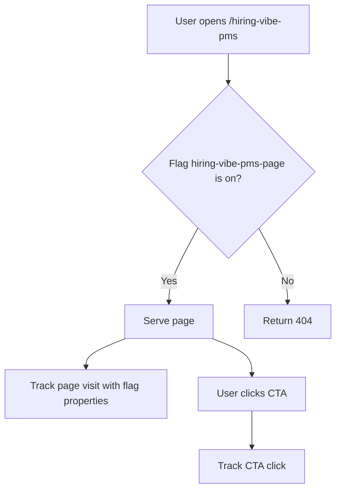

# Feature Flags and Experiments

Noted uses Amplitude as the shared product layer for analytics, feature flags, and experiments.

The goal is to keep launch control and measurement in one place so PMs can see the full loop: ship behind a flag, measure behavior, review evidence, then keep, iterate, or roll back.

## Tooling

- Use `@amplitude/analytics-browser` for client-side analytics events.
- Use `@amplitude/experiment-node-server` for server-side feature flag evaluation.
- Use `@amplitude/experiment-js-client` for client-side feature flag evaluation.
- Do not add another flagging or experimentation vendor without an explicit architecture decision.
- Do not call Amplitude Experiment directly from product routes or components. Server checks go through `lib/feature-flags.ts`; client checks go through `lib/client-feature-flags.ts` or `hooks/use-client-feature-flag.ts`.
- Do not call Amplitude Analytics directly from product components. Add typed helpers in `lib/analytics.ts`.

## Required Environment Variables

```env
NEXT_PUBLIC_AMPLITUDE_API_KEY=
AMPLITUDE_EXPERIMENT_SERVER_DEPLOYMENT_KEY=
NEXT_PUBLIC_AMPLITUDE_EXPERIMENT_CLIENT_DEPLOYMENT_KEY=
HIRING_VIBE_PMS_PAGE_DEFAULT=true
```

`NEXT_PUBLIC_AMPLITUDE_API_KEY` is public and initializes browser analytics.

`AMPLITUDE_EXPERIMENT_SERVER_DEPLOYMENT_KEY` is private and evaluates server-side flags. Do not expose it with a `NEXT_PUBLIC_` prefix.

`NEXT_PUBLIC_AMPLITUDE_EXPERIMENT_CLIENT_DEPLOYMENT_KEY` is public and evaluates client-side flags after the app has loaded.

`HIRING_VIBE_PMS_PAGE_DEFAULT` is the local and outage fallback for the `hiring-vibe-pms-page` flag.

Create two Amplitude Experiment deployments per environment:

- `server`, type **Server-side**: route gates, server components, API routes, backend logic.
- `client`, type **Client-side**: browser UI variations, component-level experiments, modal/banner/CTA tests.

## Naming

Flag keys should be lowercase kebab-case:

```text
area-feature-purpose
```

Examples:

```text
hiring-vibe-pms-page
editor-ai-inline-rewrite
files-cover-image-upload
```

Event property names should be snake_case:

```text
feature_flag_key
feature_flag_variant
page_path
cta_label
```

## PM Ownership

Every flag or experiment needs a PM-owned intent before implementation:

- What user or business problem are we testing?
- Which users should see it first?
- What metric or behavior will make us keep it?
- What signal will make us roll it back?
- When should the flag be removed?

If the answer is only "we want to try it," the spec is not ready.

## Engineering Pattern

Server-gated routes should use `getBooleanFeatureFlag`:

```ts
import {
  FEATURE_FLAGS,
  getBooleanFeatureFlag,
  hiringVibePmsPageDefault,
} from "@/lib/feature-flags";

const enabled = await getBooleanFeatureFlag(
  FEATURE_FLAGS.hiringVibePmsPage,
  hiringVibePmsPageDefault(),
);

if (!enabled) notFound();
```

Client-rendered UI variants should use `useClientFeatureFlag`:

```tsx
"use client";

import { useClientFeatureFlag } from "@/hooks/use-client-feature-flag";
import { FEATURE_FLAGS } from "@/lib/feature-flag-keys";

export function ExampleCta() {
  const enabled = useClientFeatureFlag(FEATURE_FLAGS.hiringVibePmsPage, false);

  return enabled ? (
    <button>Try the new flow</button>
  ) : (
    <button>Get started</button>
  );
}
```

Client-side behavior should emit explicit analytics through a typed helper:

```ts
trackHiringVibePmsPageVisited({
  page_path: "/hiring-vibe-pms",
  feature_flag_key: FEATURE_FLAGS.hiringVibePmsPage,
  feature_flag_variant: "on",
});
```

For client components, import shared keys from `@/lib/feature-flag-keys` instead of `@/lib/feature-flags` because `feature-flags.ts` owns server-side evaluation.

For new flags, add the key to `FEATURE_FLAGS` in `lib/feature-flag-keys.ts` and add any required fallback helper. Do not hardcode flag strings throughout the app.

Use server-side evaluation when the user should not receive the route, data, or restricted code path if the flag is off. Use client-side evaluation when it is acceptable for the page to load and only the rendered UI changes.

## Analytics Requirements

Every flagged feature must track:

- Exposure or page/surface visit with `feature_flag_key` and `feature_flag_variant`.
- Primary user action, such as CTA clicked, document created, upload completed, or workflow started.
- Failure or rollback-relevant behavior when applicable.

Never send document text, AI conversation contents, file contents, full emails, or other PII to Amplitude event properties.

## PRD Requirements

Every PRD for a flagged feature should include:

- Flag key and default behavior.
- Rollout audience and initial percentage or targeting rule.
- Success metric and guardrail metric.
- Event names and event properties.
- QA plan for flag on and flag off.
- Cleanup condition.
- Mermaid flowchart for the user path and decision points.

Example:



## QA Checklist

Before opening a PR:

- Confirm the feature works with the flag on.
- Confirm the fallback behavior works with the flag off.
- Confirm local fallback works when `AMPLITUDE_EXPERIMENT_SERVER_DEPLOYMENT_KEY` is unset.
- Confirm at least one Amplitude event fires for the surfaced experience.
- Confirm the event has no PII.
- Confirm tests cover the default behavior or the wrapper fallback.

## Cleanup

Temporary release flags should not live forever.

After the feature is fully launched or rejected:

- Remove dead code for the losing or disabled path.
- Remove the fallback env var if it only served that flag.
- Archive or delete the flag in Amplitude.
- Update the PRD or ship log with the final decision.
