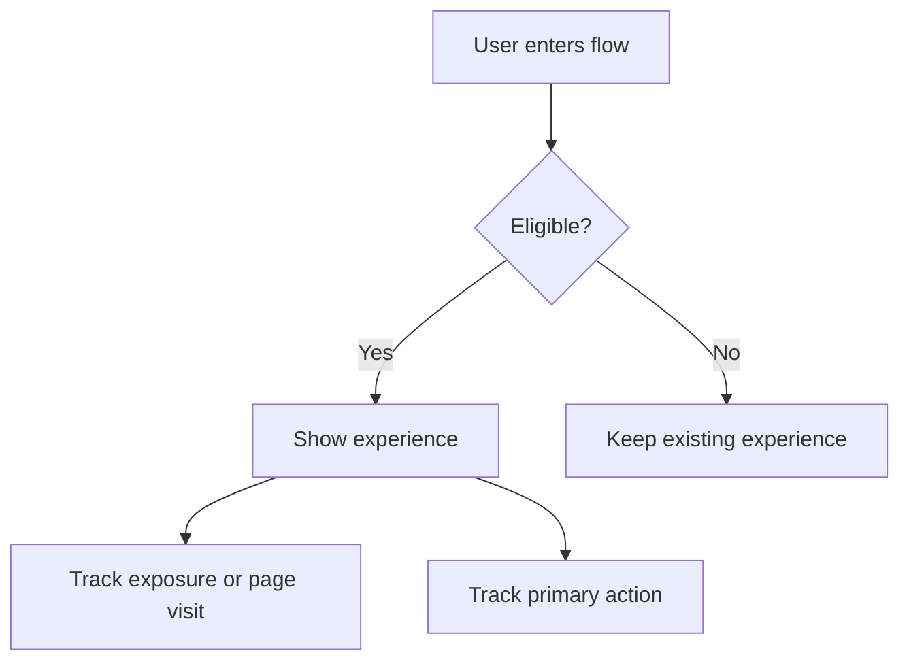

# Hand off: [Feature Name] PRD ([Existing feature | New feature])

<aside>
💡 **TL;DR:** [One-sentence product bet with target metric]
</aside>

<aside>
📣 **Slack:** #[channel]
</aside>

<aside>
🖼️ **Designs:** [Whimsical] [Figma]
</aside>

<aside>
📊 **Dashboard:** Can be found [add link]
</aside>

# Context

- What is the problem to be solved? How critical is the problem?
  - [Problem, severity, affected segment, evidence]
- What is the proposed solution?
  - **Near-term**: [What this PRD will execute]
  - **Long-term**: [Where this could go later]
  - This PRD will focus on **[near-term execution / selected scope]**
- What is the customer value?
  - [Customer outcome]
- What is the business value?
  - [Business outcome]
- Describe or link any previous attempts to solve this problem, and what happened
  - [Previous attempt, result, lesson learned, or N/A]

# Key assumptions:

- **[Assumption]** — [validated by data/interviews/research, partially validated, or pending validation; owner/source]
- **[Assumption]** — [validated by data/interviews/research, partially validated, or pending validation; owner/source]
- **[Assumption]** — [validated by data/interviews/research, partially validated, or pending validation; owner/source]

# Objectives

- Primary metric: [target, baseline, source, timeframe]
- Check metrics: [guardrail/check metric 1], [guardrail/check metric 2]
- Decision metric source: [Amplitude dashboard / Convex query / manual readout]

# Design scope:

- Who is the customer?
  - [Specific customer segment]
- What goals are we helping the customer accomplish?
  - [Goal 1]
  - [Goal 2]
- What does the customer experience look like?
  - [Entrypoint]
  - [Main flow]
  - [End state]
  - [Empty/error/skip states]
- What devices does this impact?
  - [Desktop / mobile web / app / admin / other]
- What is the user flow?

# Eng scope:

_Best filled after designs are completed_

- How does the flow change from customer perspective?
  - [Customer-visible change]
- How does the logic change?
  - [State, routing, data model, permissions, recommendation, or AI behavior change]
- What feature flag or rollout control is needed?
  - Flag key: `[feature-flag-key]`
  - Default behavior: [on/off/fallback]
- What new paths need to be logged?
  - [Event: when shown/exposed]
  - [Event: when started/dismissed]
  - [Event: step completion or response]
  - [Event: final completion]
  - [Event: downstream engagement]
- For AI features, what behavior needs to be specified?
  - Model provider(s): [OpenAI / Anthropic / Google / BYOK]
  - Convex tables touched: [`convex/schema.ts` references]
  - Streaming vs one-shot: [answer]
  - Input/output examples: [add 15-25 examples before solution review]
  - Rejection criteria and edge cases: [answer]

# Data scope:

- What data coverage or quality questions need to be answered?
  - [Question]
- What dashboard or query will be used for readout?
  - [Amplitude dashboard / Convex query / manual analysis]
- How will we know the experience is better than the current alternative?
  - [Comparison method]
- What analysis must be completed before launch or readout?
  - [Analysis]

# Ops scope:

- What changes for Customer Success, Ops, Sales, Legal, or Support teams are required?
  - [Change or N/A]
- Does the process change?
  - [Change or N/A]
- What proactive response or FAQ is needed?
  - [Response or N/A]

# Experiment design:

Full context is covered in Experiments section.

- What are you trying to learn?
  - [Learning goal]
- Who is eligible?
  - [Eligibility]
- When should they be bucketed, and at what ratio?
  - [Moment and ratio, e.g. when active on site, 50/50]
- What is your primary metric?
  - [Metric and target]
- What are your check metrics?
  - [Guardrails and acceptable movement]
- How many samples do you need to detect the primary metric impact at 95% confidence?
  - [Sample size or NEED]
- Given the required samples, how long will this run for?
  - [Runtime]
- What is the decision criteria?
  - [Roll out, roll back, or iterate criteria]

# Launch plan

- MM/DD: Internal testing — [owner]
- MM/DD: Launch demo — [owner]
- MM/DD: Launch AB test or rollout — [owner]
- MM/DD: Decide on whether to roll back, iterate, or roll out — [owner]

---

_Template inspired by [aakashg/pm-claude-code-setup](https://github.com/aakashg/pm-claude-code-setup) (MIT) and adapted to Noted's hand-off PRD format._
